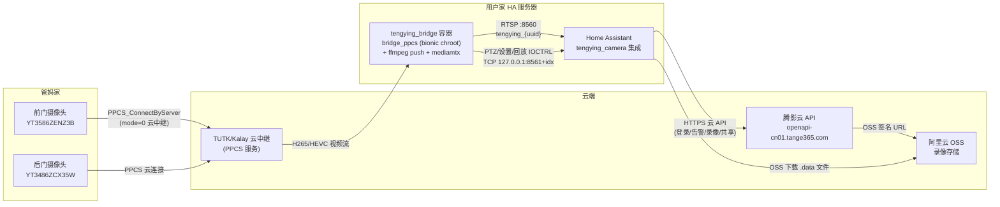
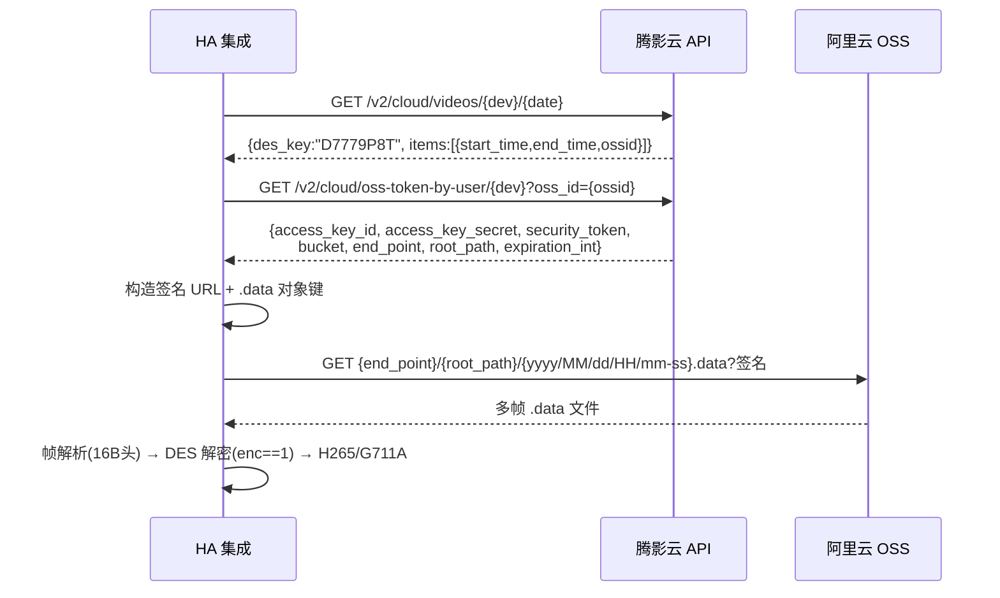

# 腾影智联（YingTeng）摄像头逆向工程 + Home Assistant 集成 — 技术文档

> **版本**: 0.2.1（HA 集成）· bridge 0.5.0
> **日期**: 2026-08-09
> **目标**: 将「影腾智联」App（com.yingteng.ipc）的摄像头能力完整复刻到 Home Assistant，支持异地（非局域网）远程监控。

---

## 目录

1. [项目概述](#1-项目概述)
2. [系统架构](#2-系统架构)
3. [协议逆向成果](#3-协议逆向成果)
4. [PPCS 收流桥（bridge）](#4-ppcs-收流桥bridge)
5. [云端录像下载链路](#5-云端录像下载链路)
6. [设备指令系统](#6-设备指令系统)
7. [双向语音对讲](#7-双向语音对讲)
8. [HA 集成（tengying_camera）](#8-ha-集成tengying_camera)
9. [部署指南](#9-部署指南)
10. [实测验证记录](#10-实测验证记录)
11. [使用手册](#11-使用手册)
12. [已知限制与后续路线](#12-已知限制与后续路线)

---

## 1. 项目概述

### 1.1 背景

用户家中安装两台「影腾智联」智能摄像头（前门 YT3586ZENZ3B / 后门 YT3486ZCX35W），摄像头位于**异地（父母家）**，只能通过云端远程访问。目标是摆脱 App，把全部功能纳入 Home Assistant 统一管理。

### 1.2 关键约束

| 约束 | 影响 |
|---|---|
| 异地部署，无 LAN 直连 | P2P 通道必须走**云中继**（禁 LAN 搜索） |
| 设备固件私有协议 | 完整逆向 App（APK 脱壳 + JADX 反编译 + so 符号分析） |
| HA 服务器是 Supervisor 托管（Docker） | bridge 以**独立容器**运行，HA 集成走 custom_component |
| so 为 Android arm64（bionic libc） | 需要 **bionic chroot** 才能在 HA Linux 上运行 |

### 1.3 实现能力全景

| 能力 | 状态 | 实现方式 |
|---|---|---|
| 多设备实时直播 | ✅ 已实现 | PPCS 收流 → ffmpeg push → mediamtx RTSP |
| PTZ 云台控制 | ✅ 已实现 | IOCTRL 4097 + 6B payload，8 方向 + 速度 + 自动停 |
| 云端录像回放/下载 | ✅ 已实现 | OSS 签名 URL + DES 解密 + H265 提取 + mp4 合成 |
| 告警消息中心 | ✅ 已实现 | POST /v2/cloud/event（motion/body/car/pet/sound/ai_summary） |
| AI 识别推送 | ✅ 已实现 | 告警消息 tag 过滤（人形/车辆/宠物） |
| 设备设置（红外/补光/移动跟踪） | ✅ 已实现 | IOCTRL 透传 + switch 实体（乐观状态） |
| SD 卡录像回放 | ✅ 已实现 | IOCTRL 794 回放控制 |
| 设备共享 | ✅ 已实现 | 共享码生成/列表/取消（App 内可添加） |
| 语音对讲（双向） | ✅ 已实现 | 上行：`PPCS_Write(ch5, SFrameInfo+G711A)` 喊话；下行：`PPCS_Read(ch1)` 收设备麦克风 |
| 新设备配网 | ❌ 未实现 | 需设备本地 Wi-Fi，异地场景用不上 |

---

## 2. 系统架构



### 2.1 数据流分层

```
┌─────────────────────────────────────────────────────────────┐
│ 设备侧（爸妈家）                                              │
│   摄像头固件（TUTK SDK）→ 云中继（PPCS 隧道）                  │
└─────────────────────────────────────────────────────────────┘
                              │
                              ▼
┌─────────────────────────────────────────────────────────────┐
│ 收流桥层（用户家 HA 服务器，tengying_bridge 容器）             │
│   bridge_ppcs (C, bionic chroot)                            │
│     ├─ PPCS_Read 循环收流 → stdout (HEVC Annex-B NAL)        │
│     ├─ TCP ctrl_server :8561+idx（PTZ/设置/回放/音频上行）     │
│     └─ | ffmpeg -f hevc → RTSP push → mediamtx :8560        │
└─────────────────────────────────────────────────────────────┘
                              │
                              ▼
┌─────────────────────────────────────────────────────────────┐
│ HA 集成层（tengying_camera custom_component）                │
│   camera（RTSP stream_source）· sensor（在线/告警）           │
│   switch（红外夜视/移动跟踪）· 14 个服务                      │
└─────────────────────────────────────────────────────────────┘
```

### 2.2 组件清单

| 组件 | 位置 | 说明 |
|---|---|---|
| `tengying_bridge:0.5.0` 容器 | HA 服务器，`--privileged --network host` | 收流 + RTSP + 控制通道 + 音频下行 |
| `mediamtx` | 容器内 :8560 | RTSP 服务器（publisher 模式） |
| `bridge_ppcs`（arm64 bionic） | 容器内 /data/ | NDK 交叉编译的 C 桥 |
| `libPPCS_API.so`（原版） | 容器内 bionic rootfs | 从 APK 提取的厂商 P2P 库 |
| `tengying_camera` 集成 | `/config/custom_components/tengying_camera/` | HA 侧全部逻辑 |

---

## 3. 协议逆向成果

### 3.1 逆向工具链

| 工具 | 用途 |
|---|---|
| APK 脱壳 | MuMu 模拟器提取运行态 dex |
| JADX（jadx_v2.4.0 + jadx14） | Java 反编译（注意：不同 dex 输出不同，jadx14 有 Cs2Camera，jadx_v2.4.0 没有） |
| NDK llvm-nm | so 动态符号表分析（`llvm-nm -D --defined-only`） |
| 抓包 | App 真实流量对比验证 |

### 3.2 Connection Blob 解密

App 从云端获取 `connection` blob，解密后得到 P2P 连接参数：

```
算法: Base64 解码 → 8 字节循环 XOR
密钥: F0 E1 D2 C3 B4 A5 96 87
```

解密产物（传给 bridge 的三个参数）：
- `p2pid`: 设备 P2P ID（含逗号后缀也可，原样传入）
- `pwd`: 设备密码（≤48 字节，每 8 字节一组参与连接认证）
- `initstring`: 全局 InitString（去掉 "ppcs:" 前缀）

### 3.3 PPPP 帧格式（旧协议参考）

```
[f1][type][size:2BE][d1][ch][idx:2BE][payload]
```

### 3.4 PPCS 连接序列（与 App Cs2Camera 一致）

```
1. PPCS_Initialize(JSON)         # 全局 InitString + SessAliveSec + MaxNumSess
2. PPCS_ConnectByServer(p2pid, mode=0, timeout, initstr)
   # ⚠️ 第 2 参数 = bEnableLanSearch：
   #    0   = 禁 LAN 搜索，走云中继（异地必须）✅
   #    123 = 开启 LAN 搜索，会卡死 ❌
3. PPCS_Write(sid, ch0, 32770 密码包)    # 60B payload，密码放 [8..]
4. PPCS_Write(sid, ch0, 511 启流包)      # [channel=2][mode=0] → 主码流
5. PPCS_Write(sid, ch0, 768 音频包)      # [channel=1][mode=0]
6. PPCS_Write(sid, ch0, 800 清晰度包)    # [channel=0][quality=1]
7. PPCS_Read(sid, ch0, ...)              # 循环收流
```

### 3.5 收流帧格式（16B 头）

```
[0]codec    [1]subType   [2]flags  [5..7]序号 LE24
[8..11]帧长 LE32         [12..15]时间戳
```

- **设备主码流 = HEVC/H.265 1080p**（非 H.264！ffmpeg 必须用 `-f hevc` 输入）
- 视频数据为含 `00 00 00 01` 起始码的 Annex-B NAL
- 90 秒无数据自动重连

### 3.6 云 API 端点（全部实测）

**认证**（`x-tg-*` 头 + Bearer token）：

```
POST https://ep.tange365.com/service          # 服务发现（不可达时回退 cn01）
POST {open_api}/v2/user/login                  # 登录 → access_token
POST {api}/app/device/list/least               # 设备列表
POST {open_api}/v2/device/online               # 批量在线状态
POST {open_api}/v2/device/thumbnail            # 缩略图
```

**录像**（见第 5 章）：

```
GET  {open_api}/v2/cloud/videos/{dev}/{date}            # 录像列表
GET  {open_api}/v2/cloud/oss-token-by-user/{dev}?oss_id=  # OSS 凭证
```

**告警消息**：

```
POST {open_api}/v2/cloud/event                 # 分页消息（motion/body/car/pet/sound/ai_summary）
POST {open_api}/v2/cloud/filter                # 消息分类
GET/POST {open_api}/v2/cloud/switcher/{dev}    # 推送开关
```

**设备共享**：

```
GET  {open_api}/v2/share/code/{dev}/{timeout}  # 生成共享码（SC://xxx）
GET  {open_api}/v2/share/{dev}                 # 共享列表
POST {open_api}/v2/share/cancel/{dev}          # 取消共享
```

**关键常量**（来自 APK 反编译）：

```
APP_ID      = "AD_2eVJIyCyBkZQ93IJt9XO6fRyE5A"
APP_PKGNAME = "com.yingteng.ipc"
APP_VERSION = "2.4.0"
SDK_VERSION = "21903"
```

---

## 4. PPCS 收流桥（bridge）

### 4.1 为什么需要 bionic chroot

`libPPCS_API.so` 是 Android arm64 动态库，依赖 bionic libc（Android 的 C 运行库），在标准 glibc Linux 下无法加载。方案：

```
MuMu 模拟器 arm64 rootfs（linker64 + libc 等 ~3MB）
  → 部署到 HA 服务器 /opt/bionic/
  → mount proc/dev/sys + chroot /opt/bionic
  → /system/bin/linker64 加载 /data/bridge_bionic
```

配套 shim 库（NDK 编译，补齐 bionic 缺失符号）：
- `liblog_shim.c` — 假 liblog
- `libstdcpp_shim.c` — 假 libstdc++
- `bionic_shim.c` — 其他缺失符号

### 4.2 bridge_ppcs.c 架构

```
bridge_ppcs <p2pid> <pwd> <initstring> [mode] [ctrl_port] [audio_down_port]
```

| 模块 | 职责 |
|---|---|
| 连接引擎 | 复刻 Cs2Camera 连接序列（见 3.4） |
| 收流循环 | `PPCS_Read(sid, ch0)` 循环 → stdout（HEVC NAL） |
| HEVC 参数集管理 | 缓存 VPS/SPS/PPS，GOP 中途接入时前置输出，`ps_should_skip` 去重（防 mediamtx invalid sprop-sps） |
| 跨块 NAL 重组 | `acc_append`/`emit_acc` 处理大帧跨 `PPCS_Read` 分块 |
| 自动重连 | 90s 无数据 → 重连 |
| **TCP 控制线程** | 监听 `127.0.0.1:{8561+idx}`，JSON 命令 → PPCS_Write |
| **查询响应缓冲** | `resp_store`/`resp_wait`：recv_loop 收到 AVIOCTRL RESP 存入，ctrl_server `wait=1` 同步返回（v0.3.0） |
| **音频上行** | `{"audio":"<hex>"}` → `PPCS_Write(sid, ch5, SFrameInfo+G711A)`（v0.4.0） |
| **音频下行** | 独立线程 `PPCS_Read(ch1)` 收帧 → 环形缓冲 → `8661+idx` TCP 推送原始帧 `[16B头][payload]`（v0.5.0） |

### 4.3 控制通道协议（TCP 127.0.0.1:8561+idx）

```
请求:  {"io": <指令码>, "payload": "<hex>"}
       {"io": <指令码>, "payload": "<hex>", "wait": 1}   # 同步等待设备响应
       {"audio": "<SFrameInfo+G711A hex>"}               # 音频上行（ch5）
响应:  {"ret": <写入字节数/错误码>}
       {"ret": 0, "resp_io": 794, "resp": "<hex>"}       # wait 模式
```

错误码约定：负值 = 本地错误（-98 无会话 / -99 解析失败），非负 = PPCS_Write 返回值。

### 4.4 run.sh 多设备管道（v4）

```
启动流程:
 1. 挂载 bionic proc/dev/sys
 2. 起 mediamtx（RTSP :8560, publisher 模式）
 3. 每设备 spawn_device:
      fetch_creds.py（登录 → 刷新 p2pid/pwd/init，凭据轮换）
      → bridge (mode=0, ctrl_port=8561+idx, audio_down_port=8661+idx)
        | ffmpeg -fflags +genpts -f hevc -i pipe:0 -c copy
          -f rtsp -rtsp_transport tcp rtsp://127.0.0.1:8560/tengying_{dev}
 4. 单设备管道退出 → 5s 独立重启（不影响其他设备）
```

**注意**：ffmpeg push 必须带 `-fflags +genpts`（bridge 输出无时间戳）；RTSP 走 TCP 传输。

---

## 5. 云端录像下载链路

### 5.1 完整协议（2026-08-09 实测打通）



### 5.2 接口细节

**① 录像列表**

```
GET {open_api}/v2/cloud/videos/{device_id}/{YYYY-MM-DD}
→ {"des_key": "D7779P8T", "items": [{"start_time": 秒, "end_time": 秒, "ossid": "192"}]}
```

**② OSS 凭证**（⚠️ 正确路径，此前误用的 `POST /v2/cloud/oss` 是 404 假接口）

```
GET {open_api}/v2/cloud/oss-token-by-user/{device_id}?oss_id={ossid}
→ {"access_key_id", "access_key_secret", "security_token",
   "expiration_int", "bucket", "end_point", "region_id",
   "root_path", "platform", "ossid", "url"}
```

### 5.3 .data 文件路径（5 秒取整 + 设备时区）

```
ts5(ms) = (ms//1000 - (ms//1000)%5) * 1000        # DateUtil.getTimestampFiveSec
path = {root_path}/{YYYY}/{MM}/{dd}/{HH}/{mm-ss}.data
       # 设备时区（默认 +08:00，App requireTimezone 接口未接入）
```

实测：`YT3586ZENZ3B/2026/08/09/00/00-00.data`（00:00:00 前 60 秒 → 每 5 秒一个文件，共 12 个）。

### 5.4 OSS 签名 URL（核心难点）

```
StringToSign = "GET\n\n\n{expiration_int}\n/{bucket}/{obj_key}?security-token={st}"
Signature    = base64( HMAC-SHA1(access_key_secret, StringToSign) )
URL = {end_point}/{obj_key}?Expires={exp}
      &OSSAccessKeyId={quote(ak)}&Signature={quote(sig)}
      &security-token={quote(st)}
```

> ⚠️ **关键坑**：`security-token` 在阿里 OSS SDK 的 `SIGNED_PARAMTERS` 常量里，**必须参与签名**（CanonicalizedResource 带 `?security-token=`）。这是 4 轮 SignatureDoesNotMatch 实验后的核心发现。Signature/OSSAccessKeyId 必须 URL 编码（`+` → `%2B`）。

### 5.5 .data 帧格式（16B 头，大端）

```
[0]    = 0（固定）
[1]    = media type: 0=Timestamp / 1=H264 / 2=G711A / 10=IJPG / 13=H265
[2:4]  = keyFrame（BE16）
[4:8]  = payload length（BE32）
[8:12] = timestamp（BE32）
[12:16]= encodeType（BE32）
+ payload
```

### 5.6 DES 解密（⚠️ 判断方向与 JADX 注释相反）

```
encodeType == 1 → payload 需要解密
算法: DES/CBC/PKCS5Padding
密钥: des_key 的 UTF-8 字节（如 "D7779P8T" 8 字符）
IV:   {1, 2, 3, 4, 5, 6, 7, 8}
```

> ⚠️ **实测纠正**：JADX WARN 注释写 `if (encodeType != 1) decrypt`，实测相反。关键帧 `f4` 解密后 = `00 00 00 01 40 01 0c 01`（H265 VPS 参数集），其余 = `02 01` slice NAL —— 解密后才是合法 H265 流。

### 5.7 mp4 合成（HA 集成内置）

```
ffmpeg -y -f hevc -framerate 15 -i video.h265 \
       -f alaw -ar 8000 -ac 1 -i audio.g711a \
       -c:v copy -c:a aac -t {duration} out.mp4
```

> ⚠️ **禁用 `-shortest`**：H265 裸流时间戳未设置（`Timestamps are unset in a packet`），`-shortest` 会认为视频流更短而把音频全裁掉（audio:0KiB 事故）。

---

## 6. 设备指令系统

### 6.1 AVIOCTRL 用户指令表（AVIOCTRLDEFs.java 逆向）

| 功能 | 查询(REQ) | 设置(SET) | payload |
|---|---|---|---|
| 日夜模式 | 32790 | **32792** | 12B，mode@offset4 LE（0=AUTO 1=OFF 2=ON） |
| 双光源(补光灯) | 32786 | **32788** | 12B 同构 |
| 移动跟踪 | 32800 | **32802** | 12B 同构（0=OFF 1=ON） |
| 云台质量 | 32806 | 32808 | 12B 同构 |
| 设备重启 | — | **32784** | — |
| **SD 卡回放** | — | **794** | 24B（见 6.3） |
| **PTZ 云台** | — | **4097** | 6B（见 6.2） |
| 扬声器启动 | — | **848** | 8B `[ch:LE32=1][mode:LE32=0]` |
| 对讲开始 | — | 818 | START_TALK |

### 6.2 PTZ payload（6B）

```
[方向(1-8)][0][0][0][0][速度(1-255)]
方向: 0=stop 1=up 2=down 3=left 4=left_up 5=left_down 6=right 7=right_up 8=right_down
```

实测：`{"io":4097,"payload":"010000000064"}` → `{"ret":14}`（6B 头 + 6B payload 完整写入）。

### 6.3 SD 卡回放 payload（SMsgAVIoctrlPlayRecord 24B）

```
[Param:LE32=0][avIndex:LE32=0][channel:LE32=0]
[stTimeDay:8B][command:LE32]

stTimeDay: [year:LE16][month][day][wday][hour][minute][second]
command:   16=START 1=STOP 0=PAUSE 7=END 8=CONTINUE
```

实测：`io=794` START/STOP → `ret=32`（24B payload 正确）。回放期间视频流自动切 SD 内容，stop 后 run.sh 恢复直播。

### 6.4 设置 payload 构造（12B，⚠️ 必须小端）

```
struct.pack("<III", 0, mode, 0).hex()
# mode=2 → "000000000200000000000000"  ← 手写 hex 容易少字节（教训）
```

### 6.5 ⚠️ 已知限制：GET 查询响应不可达

设备对查询指令（32790 等 REQ）的响应走 `IOTC_User_Ioctrl` 回调，**PPCS 封装层不暴露该回调**（ch0 收不到 RESP 数据）。因此：

- SET 指令可正常下发（实测 ret=20）
- GET 查询无法回读状态 → switch 用**乐观状态**（重启后回默认值）
- bridge v0.3.0 的 `resp_wait` 能力已实现但设备响应不可达，保留备用

---

## 7. 双向语音对讲

### 7.1 上行（喊话）——重大反转

最初判定"PPCS 无音频上行 API，架构受限不可行"——**错误**。复查 so 完整导出符号后确认：

```
Cs2Camera.sendAudioData (jadx14) 使用:
  PPCS_Write(sid, ch=5, [16B SFrameInfo 帧头] + [G711A 数据])
```

- **发送音频通道 = 5**（`P2pCamera.chIndexForSendAudio = 5`），不是 1
- 用 `PPCS_PktSend` 返回 -5（ERROR_PPCS_INVALID_PARAMETER）——走错 API
- 正确 API 就是普通的 `PPCS_Write`，只是通道号不同

### 7.2 下行（收听设备麦克风）——逆向结论

```
d.java 音频接收线程（AudioReceiveMonitor）:
  readP2PData(ch=1, 16) 读帧头
  → codec(LE16@0)==138/134 && 0<=size<=1024
  → readP2PData(ch=1, size) 读 payload
  → receiveAudioData(AVFrames(codec, data, ts))

底层: Cs2Camera.readP2PData → readPPCS → 循环 PPCS_Read(sid, ch1, ...)
```

- **接收音频通道 = 1**（`Camera.chIndexForRecvAudio = 1`，App 连接时赋值）
- 帧头与上行 SFrameInfo 同构：`[codec_id:LE16@0=138(G711A)|134][flags@2][...][size:LE32@8][ts:LE32@12]`
- 实测数据：**320B/帧 = 40ms @ 8kHz A-law**，时间戳 40ms 稳定
- 注意：App 连接序列已发 768 音频包启动音频流 → ch1 无需额外握手即有数据

### 7.3 SFrameInfo 帧头（16B，上行/下行共用格式）

```
[codec_id:LE16=138]        # 音频（下行也接受 134）
[flags=2 或 10]            # 2=8kHz G711A
[cam_index]                # 上行=5；下行=1（即通道号）
[0][reserved:3B]
[frame_size:LE32]
[timestamp:LE32]           # 毫秒
+ G711A payload（上行每块 ≤1600B；下行每帧 320B）
```

### 7.4 bridge v0.5.0 音频下行实现

```
设备麦克风 ──ch1──▶ audio_recv_thread（独立线程，不阻塞视频主循环）
                    PPCS_Read(ch1,16) 读头 → 读满 size 字节 payload
                    → 512KB 环形缓冲（帧定界 [flen:LE32][帧]）
                    → audio_down_server 监听 127.0.0.1:8661+idx
                    → 每个连接客户端持续推送原始帧 [16B头][payload]
```

### 7.5 HA 服务链路

**talkback（上行，v0.4.0）**：
```
音频文件(wav/mp3)
  → ffmpeg -ar 8000 -ac 1 -f s16le（8kHz PCM16）
  → 纯 Python A-law 编码（⚠️ HA 容器 ffmpeg 没有 alaw 编码器！）
  → SFrameInfo 帧头封装（1600B/块）
  → {"audio":"<hex>"} → bridge ch5 → PPCS_Write(sid,5) → 设备扬声器
```
实测：`PPCS_Write(sid, 5, 1616B)` → `ret=1616`（完整写入）。3 秒音频 → 15 chunks / 24000B 全部上行成功。

**audio_down（下行，v0.5.0）**：
```
连接 8661+idx → 采集 N 秒原始帧
  → 提取 payload 存 .g711a → ffmpeg -f alaw 转 .wav
  → 返回 /local/... 播放链接
```
实测：8 秒 204 帧（codec=138，65280B）→ wav 128KiB/8.16s PCM8k；HA 服务 5 秒 125 帧/40000B → 双文件 + URL。

---

## 8. HA 集成（tengying_camera）

### 8.1 文件结构

```
custom_components/tengying_camera/
├── __init__.py        # 入口 + 全部服务注册（14 个）
├── api.py             # 云 API 客户端（登录/设备/录像/告警/共享/OSS token）
├── cloud_download.py  # 云端录像下载核心（OSS 签名 + .data 解析 + DES 解密）
├── coordinator.py     # 数据协调器（设备列表+在线+最新告警，60s 轮询）
├── camera.py          # camera 实体（RTSP stream_source + 缩略图兜底）
├── sensor.py          # sensor 实体（在线状态 + 最新告警）
├── switch.py          # switch 实体（红外夜视 + 移动跟踪，乐观状态）
├── services.yaml      # 14 个服务 schema
├── const.py           # 常量（App 凭据 + 端点 + 头）
├── config_flow.py     # 配置流
└── manifest.json      # v0.2.1，requirements: pycryptodome>=3.18.0
```

### 8.2 服务清单（14 个）

| 服务 | 说明 | supports_response |
|---|---|---|
| `ptz` | 云台 8 方向 + 速度 + 自动停 | — |
| `list_records` | 云端录像列表 | ONLY |
| `download_record` | 下载录像 → H265/G711A/mp4 + `/local/` URL | ONLY |
| `list_messages` | 告警消息分页（tag 过滤） | ONLY |
| `list_message_categories` | 消息分类 | ONLY |
| `get_push_switches` | 推送开关配置 | ONLY |
| `set_push_switch` | 单事件推送开关（局部修改整包提交） | ONLY |
| `device_command` | 任意 IOCTRL 下发 | ONLY |
| `record_play` | SD 卡回放控制（start/stop/pause/continue/end） | ONLY |
| `share_code` | 生成共享码 | ONLY |
| `share_list` | 共享列表 | ONLY |
| `share_cancel` | 取消共享 | ONLY |
| `talkback` | 语音上行（文件 → 设备扬声器喊话） | ONLY |
| `audio_down` | 语音下行（采集设备麦克风 N 秒 → wav + `/local/` URL） | ONLY |

### 8.3 实体清单（每设备）

| 实体 | 类型 | unique_id | 状态 |
|---|---|---|---|
| `{name}` | sensor | `tengying_{uuid}` | 在线/离线 |
| `{name} 最新告警` | sensor | `tengying_{uuid}_alarm` | 事件名（如"发现移动"） |
| `{name}` | camera | `tengying_camera_{uuid}` | RTSP 流/缩略图 |
| `{name} 红外夜视` | switch | `tengying_{uuid}_night_vision` | 乐观状态 |
| `{name} 移动跟踪` | switch | `tengying_{uuid}_motion_track` | 乐观状态 |

### 8.4 关键实现细节

- **控制端口映射**：`coordinator.ctrl_port_for()` = `8561 + devices_order.index(uuid)`（与 bridge run.sh 的索引一致，兜底映射 YT3486ZCX35W→8561、YT3586ZENZ3B→8562）；`audio_down_port_for()` 同序 = `8661 + idx`（兜底 8661/8662）
- **凭据轮换**：coordinator 60s 轮询，token 过期自动 `ensure_auth()` 重登
- **HA 2027.x 兼容**：`async_remove_service` 已移除 → 直接 `async_register` 覆盖；`supports_response=SupportsResponse.ONLY`（旧常量 SUPPORT_RESPONSE 已删）
- **download_record 多段**：按 ossid 分段下载（每段独立 token）→ 级联合并 H265/G711A → ffmpeg 合成 mp4
- **测试策略**：HA 新版 auth 存 token 哈希无法还原 LTA 明文 → REST 测试改用容器内 mock（SimpleNamespace hass/coordinator 调服务函数，等价真实路径）

---

## 9. 部署指南

### 9.1 bridge 容器（HA 服务器）

```
构建上下文: /mnt/data/tb（Dockerfile + bridge_bionic + run.sh + fetch_creds.py
            + options.json + mediamtx.yml + mediamtx 二进制 + /opt/bionic rootfs）

构建:
docker build --pull=false \
  --build-arg BUILD_FROM=ghcr.nju.edu.cn/home-assistant/aarch64-base:latest \
  -t tengying_bridge:0.5.0 /mnt/data/tb

运行:
docker run -d --name tengying_bridge \
  --privileged --network host --restart unless-stopped \
  tengying_bridge:0.5.0
```

配置 `options.json`：

```json
{
  "username": "13736776363",
  "password": "******",
  "devices": ["YT3486ZCX35W", "YT3586ZENZ3B"],
  "rtsp_port": 8560
}
```

### 9.2 HA 集成

```
SCP 全部文件 → /config/custom_components/tengying_camera/
docker restart homeassistant
（pycryptodome 由 HA 自动安装，manifest requirements）
```

### 9.3 bridge 重新编译（改动 C 源码后）

```
NDK: tools/android-ndk-r27c/toolchains/llvm/prebuilt/windows-x86_64/bin
编译: aarch64-linux-android24-clang -O2 -o build/bridge_ppcs_bionic \
        bridge_ppcs.c
上传: scp → /mnt/data/tb/bridge_bionic → chmod +x
重建镜像 → 停旧容器 → 起新容器
```

---

## 10. 实测验证记录

### 10.1 直播链路（08-09 01:08-01:30 修复后稳定）

| 检查项 | 结果 |
|---|---|
| 双设备同时直播 | ✅ 前门 + 后门 1080p HEVC 双流 |
| HA ffprobe | ✅ `stream,hevc,1920,1080` |
| 参数集去重 | ✅ 无 `invalid sprop-sps` |
| 容器稳定性 | ✅ 0.5.0 运行无重启 |

### 10.2 云端录像（08:00-08:33 打通）

| 检查项 | 结果 |
|---|---|
| 60 秒录像下载 | ✅ 12 个 .data 文件 / 0 缺失 |
| 帧提取 | ✅ 4800 帧 H265 + 2.46MB G711A |
| DES 解密 | ✅ 关键帧 → H265 VPS `40 01 0c 01` |
| 转码播放 | ✅ mp4 画面 OSD `2026-08-09 00:01:00` 真实前门红外画面 |
| HA 服务实测 | ✅ 960 帧 / 4.96MB → mp4 2.55MB → `/local/` HTTP 200 |

### 10.3 指令下发（09:26-10:05）

| 指令 | 实测 |
|---|---|
| PTZ 4097 | ✅ ret=14 |
| 日夜/双光源/移动跟踪 SET | ✅ ret=20 |
| SD 回放 794 | ✅ ret=32（2026-08-09 周日 09:38:05） |
| 告警消息 | ✅ 5 条 motion 真实告警 |
| 共享码 | ✅ `SC://3Heu...`，已有 1 共享用户 |

### 10.4 语音对讲（10:14-10:45 打通）

| 检查项 | 结果 |
|---|---|
| PPCS_Write(ch5) 1616B | ✅ ret=1616（完整写入） |
| talkback 服务 | ✅ 15 chunks / 24000B 上行 |
| 音频下行 ch1 | ✅ 8 秒 204 帧 codec=138（320B/帧=40ms@8kHz）→ wav 8.16s |
| HA audio_down 服务 | ✅ 5 秒 125 帧/40000B → g711a + wav + `/local/` URL |
| 设备端出声 | ⏳ 待用户确认（摄像头在爸妈家） |

---

## 11. 使用手册

### 11.1 直播

```yaml
# camera 实体 stream_source 自动配置
# rtsp://127.0.0.1:8560/tengying_YT3586ZENZ3B
```

### 11.2 PTZ

```yaml
service: tengying_camera.ptz
data:
  device_id: YT3586ZENZ3B
  direction: right_up
  speed: 100
  duration: 500    # ms，自动停
```

### 11.3 云端录像

```yaml
# 查列表
service: tengying_camera.list_records
data:
  device_id: YT3586ZENZ3B
  date: "2026-08-09"

# 下载（返回 mp4_url 直接可播）
service: tengying_camera.download_record
data:
  device_id: YT3586ZENZ3B
  date: "2026-08-09"
  start_time: 1786204800
  end_time: 1786218730
```

### 11.4 告警 + AI 识别（自动化推荐）

```yaml
# 查今天谁来过（人形事件）
service: tengying_camera.list_messages
data:
  device_id: YT3586ZENZ3B
  date: "2026-08-09"
  tag: body

# 人形告警 → 通知（配合 alarm sensor + automation）
automation:
  - trigger:
      platform: state
      entity_id: sensor.hou_men_hou_men_zui_xin_gao_jing
    condition:
      condition: template
      value_template: "{{ trigger.to_state.state == '发现人形' }}"
    action:
      service: notify.mobile_app_xxx
      data:
        message: "前门有人！"
```

### 11.5 设备设置

```yaml
# 开红外夜视（switch 实体）或：
service: tengying_camera.device_command
data:
  device_id: YT3586ZENZ3B
  io: 32792
  payload: "000000000200000000000000"   # mode=2 ON
```

### 11.6 SD 卡回放

```yaml
service: tengying_camera.record_play
data:
  device_id: YT3586ZENZ3B
  start_time: 1786204800
  duration: 60       # 自动停
```

### 11.7 共享给家人

```yaml
service: tengying_camera.share_code
data:
  device_id: YT3586ZENZ3B
  timeout: 600       # 秒
# 返回 SC://xxx，对方在 App「添加设备-输入共享码」添加
```

### 11.8 双向语音（喊话 + 收听）

```yaml
# 1. 喊话（TTS 生成音频后通过摄像头扬声器播放）
service: tengying_camera.talkback
data:
  device_id: YT3586ZENZ3B
  file: /config/www/tts/hello.mp3
  auto_start: true

# 2. 听现场（采集 10 秒设备麦克风 → wav）
service: tengying_camera.audio_down
data:
  device_id: YT3586ZENZ3B
  duration: 10
# 返回 wav_url → /local/tengying_records/xxx.wav 直接播放
```

**对讲自动化建议**：按一下喊话 → 再按一下听回音；或定时采集环境声做监护（独居老人动态监测）。

---

## 12. 已知限制与后续路线

### 12.1 已知限制

| 限制 | 原因 | 现状 |
|---|---|---|
| GET 设备状态不可回读 | PPCS 不暴露 IOTC_User_Ioctrl 回调 | switch 乐观状态 |
| 配网功能未实现 | 需设备本地 Wi-Fi | 异地场景用不上 |
| 跨段拼接长录像可能参数集重复 | 多段级联 H265 | 单段已验证 OK，>2h 待测 |
| OSS 签名 URL 1 小时过期 | expiration_int | 每次下载重新取 token（已内置缓存 per-ossid） |

### 12.2 后续路线（按优先级）

1. **对讲实时化**：audio_down 目前采集到文件；可增强为实时转发到媒体播放器（ffmpeg http 流 / media_player）实现免点播听现场
2. **长时段录像合并测试**：跨多 ossid 2h+ 时段
3. **告警截图自动入库**：告警 thumbnail → HA 图片实体/文件夹，配合 notify 推送
4. **正式 Release**：manifest 版本对齐 + GitHub Release（需用户授权发布）
5. **SD 卡录像列表**：目前回放按时间点控制，可加 SD 卡录像文件列表查询

---

*本文档由腾影智联逆向工程 + HA 集成项目全量实测数据整理而成。所有协议细节均来自 APK 反编译 + 真实设备验证，非推测。*
